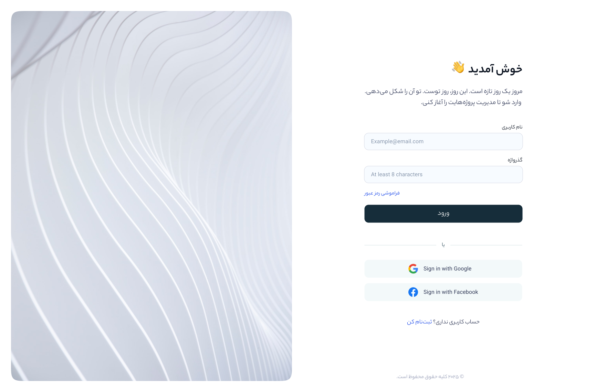
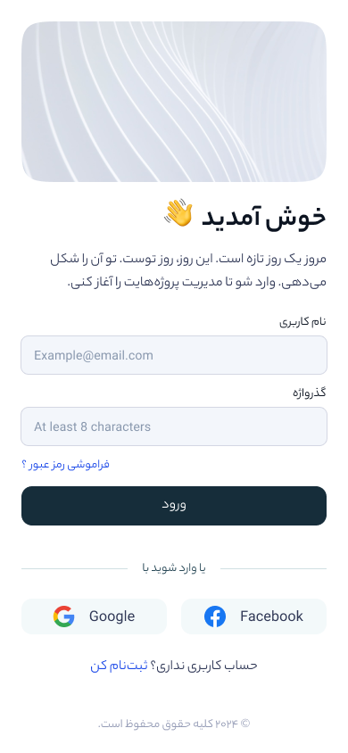
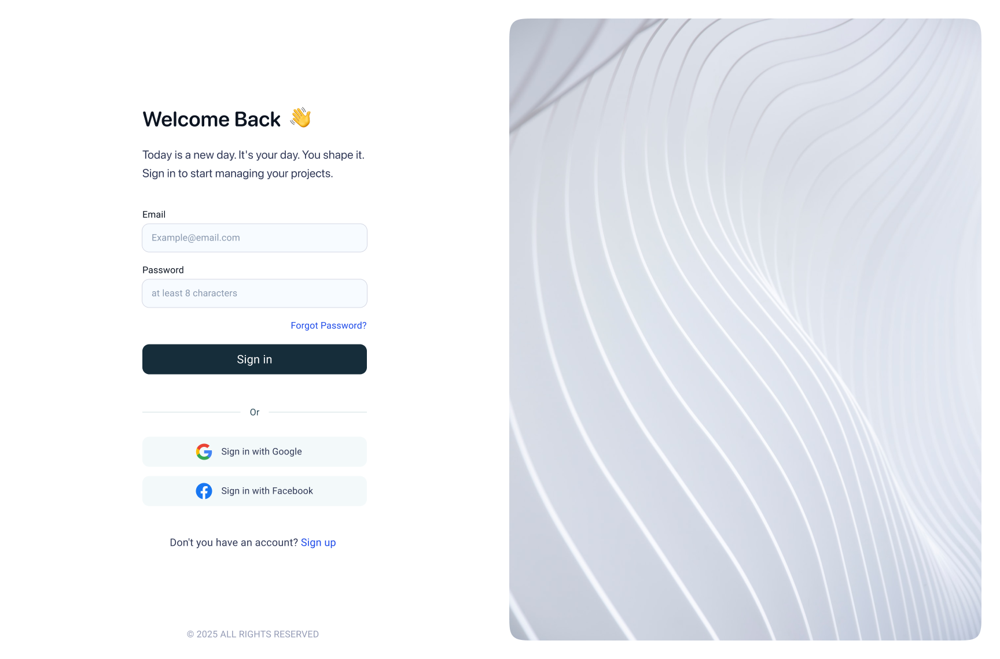
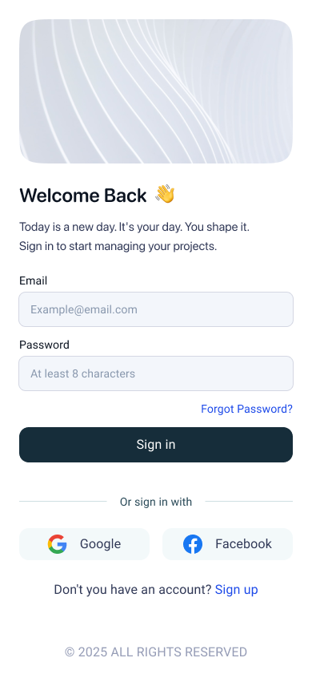

# 🇮🇷 فارسی

## 🧑‍💻 فرم ورود واکنش‌گرا - HTML/CSS/JS/Bootstrap

این پروژه شامل یک فرم ورود مدرن، راست‌چین و کاملاً فارسی است که با استفاده از تکنولوژی‌های وب زیر ساخته شده است:

- ✅ HTML5  
- ✅ CSS3  
- ✅ JavaScript  
- ✅ Bootstrap 5  

### ✨ ویژگی‌ها

- رابط کاربری تمیز، ساده و کاربرپسند  
- کاملاً واکنش‌گرا (Responsive)  
- پشتیبانی از ورود با گوگل و فیسبوک  
- طراحی راست‌چین مخصوص کاربران فارسی‌زبان  
- قابل استفاده در دسکتاپ و موبایل  

### 🖼️ تصاویر پیش‌نمایش

#### 💻 نسخه دسکتاپ  

#### 📱 نسخه موبایل  

### 🧰 پیشنهادات توسعه

- اعتبارسنجی فرم با JavaScript  
- پیاده‌سازی سیستم احراز هویت با Firebase یا JWT  
- ذخیره‌سازی توکن‌ها در LocalStorage  
- افزودن تِم تیره (Dark Mode)  

---

### 🔧 اجرای پروژه

۱. فایل‌ها را کلون یا دانلود کنید  
۲. فایل `index.html` را در مرورگر خود باز کنید  
۳. مطمئن شوید که تصاویر `Desktop.png` و `Mobile.png` در همان پوشه قرار دارند  

---

# 🇬🇧 English

## 🧑‍💻 Responsive Persian Login Page - HTML/CSS/JS/Bootstrap

This project features a modern, RTL (right-to-left) Persian login form built with the following web technologies:

- ✅ HTML5  
- ✅ CSS3  
- ✅ JavaScript  
- ✅ Bootstrap 5  

### ✨ Features

- Clean and user-friendly UI  
- Fully responsive design  
- Supports login with Google and Facebook  
- Right-to-left layout for Persian users  
- Optimized for desktop and mobile  

### 🖼️ Preview Images

#### 💻 Desktop View  

#### 📱 Mobile View  

### 🧰 Development Suggestions

- Client-side validation with JavaScript  
- Authentication via Firebase or JWT  
- Token storage using LocalStorage  
- Add support for dark mode  

---

### 🔧 How to Run

1. Clone or download the project files  
2. Open `index.html` in your browser  
3. Ensure `Desktop.png` and `Mobile.png` are in the same folder as the HTML file  

---

© 2025 کلیه حقوق محفوظ است / All rights reserved.
